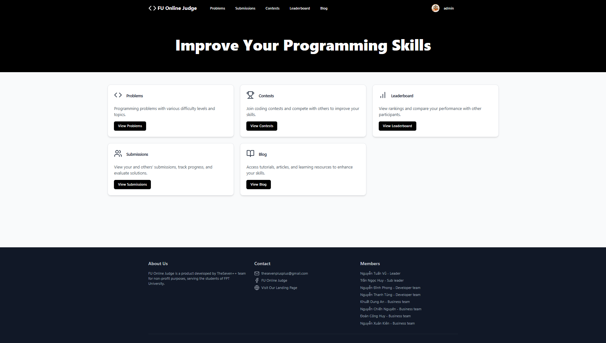

# 🧑‍💻 Nguyen Tuan Vu

**`Developer, Programmer`**

Hello! I am a full-stack developer with a passion for building management systems and a strong drive to continually learn new technologies and technical solutions. With experience in numerous algorithm competitions, I focus on developing optimal and innovative solutions. If you’re interested in connecting or collaborating on exciting projects, feel free to reach out!

---

### 🧰 Languages and Tools

 
 
 

#

### 📊 Stats

#

### 🤩 My Personal Projects

[💪 Focus Boost](https://focus-boost.vercel.app/)  

[👨‍💻 FU Online Judge](https://fuoj.tech/)  

#

  
<h3> 🧑‍💻 ntuanvu89's Coding Journey</h3>

  

I began my programming journey at the age of 15 when I entered high school. The first language I encountered was C++, and the algorithms and data structures I was taught in school helped me greatly in competitive programming contests. I joined my school's informatics team and competed in the national informatics competition for outstanding students. However, I fell short and only received consolation prizes for two consecutive years, which remains one of my biggest regrets from high school.

Upon entering university, I chose FPT University Hanoi as the next stop in my journey. I received a 100% tuition scholarship, which became a great support throughout my studies. During this time, I found JS Club (Japanese Software Club), a club that helped me mature greatly in learning new technologies. I learned to build a website system, develop an online game that attracted many players, and study new programming languages. JS Club felt like home, and I loved the people there. Besides, throughout my time at university, I participated in various programming competitions such as ICPC, the National Student Olympiad in Informatics, FTalent Code, and more. These experiences helped me maintain the skills I had developed in high school.

During my university years, I worked in several roles: as a freelance algorithm programmer, an algorithms tutor, and as an intern from the beginning of my second year.

    A challenging and rewarding journey 🤩
  

